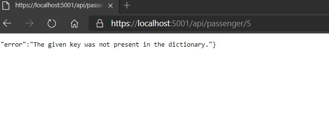
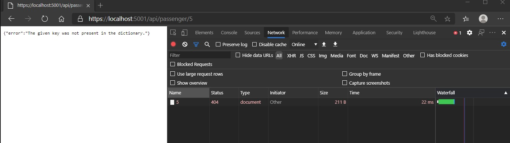

# Module 4: Extending ASP.NET Core HTTP services

## Lesson 1: The ASP.NET Core Request Pipeline

### Demonstration: Creating a Middleware for Custom Error Handling

- Abrimos el proyecto ErrorHandlingMiddlewareen Visual Studio Code

- Restauramos el proyecto

- Creamos la clase ExceptionHandlingMiddleware

  - Creamos el constructor, el metodo invoke  y un manejado de excepciones

- Creamos la clase ExceptionHandlingMiddlewareExtensions

  - Creamos el constructor

- En el startup.cs añadimos el middleware que hemos creado

- Ejecutamos

  

- Abrimos Developer Tools del navegador y en network comprobamos que devuelve un 404

  

  

  

- 

